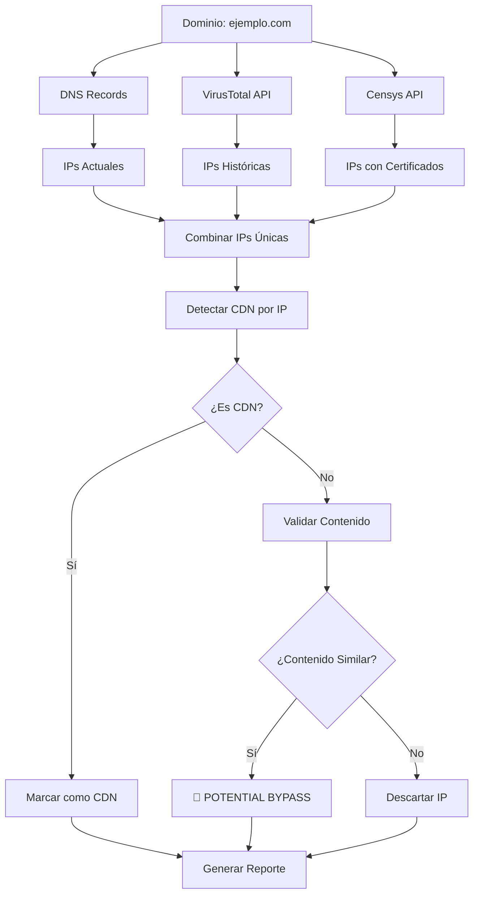

# CDN-Jump: Filosofía y Arquitectura Técnica

## 🎯 **La Esencia de CDN-Jump**

### **¿Qué Problema Resuelve?**

CDN-Jump aborda una **vulnerabilidad crítica de seguridad** conocida como **"CDN Bypass"**. Imagina esta situación:

```
🌐 Usuario → CDN (Protección) → Servidor Original
    ↓
🔓 Atacante → Servidor Original (Directo - Sin Protección)
```

**El problema:** Muchas organizaciones creen que están protegidas por su CDN (Cloudflare, Akamai, etc.), pero el **servidor original sigue accesible directamente**, evitando todas las protecciones.

### **¿Por Qué es Crítico?**

- **🛡️ Bypass de WAF**: Evita Web Application Firewalls
- **🚫 Bypass de DDoS Protection**: Ataque directo al origen
- **🔍 Bypass de Rate Limiting**: Sin restricciones de velocidad
- **📊 Bypass de Analytics**: Tráfico no monitoreado
- **🔒 Bypass de SSL/TLS Policies**: Configuraciones más débiles

---

## 🔍 **Arquitectura Técnica: ¿Por Qué Estas APIs?**

### **1. DNS Records (dnspython) - La Base**

```python
# ¿Qué hace?
dns_records = get_dns_records("ejemplo.com")
# Resultado: ['192.168.1.1', '192.168.1.2']
```

**¿Por qué es esencial?**
- **Punto de partida**: IPs actuales del dominio
- **Estado actual**: Lo que el DNS resuelve HOY
- **Limitación**: Solo muestra el presente, no el historial

### **2. VirusTotal API - El Historiador**

```python
# ¿Qué aporta?
historical_ips = virustotal_api.get_historical_ips("ejemplo.com")
# Resultado: ['192.168.1.1', '192.168.1.2', '10.0.0.1', '203.0.113.5']
```

**¿Por qué VirusTotal?**
- **📚 Memoria histórica**: IPs que resolvían en el pasado
- **🕰️ Línea temporal**: Cambios de infraestructura
- **🔍 Descubrimiento**: IPs que ya no están en DNS pero siguen activas
- **💰 Acceso gratuito**: API pública con límites razonables

**Caso real:**
```
DNS actual: ejemplo.com → 104.16.1.1 (Cloudflare)
VirusTotal histórico: ejemplo.com → [104.16.1.1, 198.51.100.5, 203.0.113.10]
                                   ↑ Cloudflare    ↑ Posibles servidores originales
```

### **3. Censys API - El Detective de Certificados**

```python
# ¿Qué descubre?
cert_ips = censys_api.search_certificates("ejemplo.com")
# Resultado: IPs que tienen certificados SSL para el dominio
```

**¿Por qué Censys?**
- **🔐 Certificados SSL**: Servidores que se identifican como el dominio
- **📡 Escaneo masivo**: Censys escanea todo Internet constantemente
- **🕵️ Infraestructura oculta**: Servidores que no están en DNS
- **🎯 Alta precisión**: Si tiene certificado para el dominio, probablemente lo sirve

**Ejemplo de descubrimiento:**
```
DNS: ejemplo.com → 104.16.1.1
Censys encuentra: 198.51.100.5 tiene certificado SSL para "ejemplo.com"
¡Posible servidor original!
```

### **4. Content Validation (BeautifulSoup) - El Verificador**

```python
# ¿Cómo valida?
original_content = get_content("ejemplo.com")
suspect_content = get_content("198.51.100.5", host="ejemplo.com")
similarity = compare_content(original_content, suspect_content)
```

**¿Por qué validar contenido?**
- **✅ Confirmación**: ¿Realmente sirve el mismo sitio?
- **🚫 Falsos positivos**: Elimina IPs irrelevantes
- **📊 Precisión**: Solo reporta bypasses reales
- **🔍 Análisis profundo**: Compara estructura HTML, no solo conectividad

---

## 🛠️ **Técnicas de Detección CDN: El Cerebro**

### **1. PTR Lookup (Reverse DNS)**
```python
# ¿Qué revela?
ptr_record = get_ptr_record("104.16.1.1")
# Resultado: "1.1.16.104.in-addr.arpa" → "cloudflare.com"
```

### **2. WHOIS Queries**
```python
# ¿Qué descubre?
whois_info = get_whois("104.16.1.1")
# Resultado: "Organization: Cloudflare Inc."
```

### **3. HTTP Headers Analysis**
```python
# ¿Qué detecta?
headers = get_headers("104.16.1.1")
# Resultado: "Server: cloudflare", "CF-RAY: abc123"
```

---

## 🎯 **Flujo Completo: La Orquestación**



## 🔥 **¿Por Qué Esta Combinación es Poderosa?**

### **Sinergia de Fuentes**
1. **DNS**: Estado actual
2. **VirusTotal**: Historia completa
3. **Censys**: Infraestructura SSL
4. **Validación**: Confirmación real

### **Cobertura Completa**
```
Escenario 1: Servidor original en DNS histórico
├── DNS actual: No lo muestra
├── VirusTotal: ✅ Lo encuentra
└── Resultado: Bypass detectado

Escenario 2: Servidor con certificado SSL
├── DNS: No lo muestra
├── VirusTotal: No lo tiene
├── Censys: ✅ Lo encuentra
└── Resultado: Bypass detectado

Escenario 3: Falso positivo
├── IP encontrada: 203.0.113.5
├── Validación: ❌ Contenido diferente
└── Resultado: Descartado
```

## 🎪 **Casos de Uso Reales**

### **Auditoría de Seguridad**
```bash
# Empresa quiere verificar su protección CDN
poetry run python -m cdnjump.cli -d miempresa.com --intensive

# Resultado: 
# ✅ 104.16.1.1: cloudflare (Protegido)
# 🚨 198.51.100.5: Potential CDN bypass (¡Problema!)
```

### **Bug Bounty**
```bash
# Hunter buscando bypasses
poetry run python -m cdnjump.cli -f targets.txt --censys

# Encuentra servidores originales expuestos
# = Vulnerabilidad de alta criticidad
```

### **Red Team Assessment**
```bash
# Equipo rojo evaluando defensas
poetry run python -m cdnjump.cli -d target.com --intensive --censys

# Mapea infraestructura completa
# Identifica puntos de ataque directos
```

---

## 🧠 **La Filosofía: "Trust but Verify"**

CDN-Jump no asume que las protecciones funcionan. **Verifica empíricamente** si:

1. **🔍 Descubrimiento**: ¿Hay más IPs de las visibles?
2. **🛡️ Protección**: ¿Todas las IPs están protegidas?
3. **✅ Validación**: ¿Las IPs no protegidas sirven el mismo contenido?
4. **📊 Reporte**: ¿Qué riesgo real existe?

## 🎯 **Valor Único**

CDN-Jump es único porque:
- **🔄 Combina múltiples fuentes** (DNS + VirusTotal + Censys)
- **📈 Análisis temporal** (presente + historial)
- **🔍 Validación real** (no solo conectividad)
- **📝 Documentación completa** (logs detallados)
- **🛠️ Automatización total** (sin intervención manual)

Esta arquitectura hace que CDN-Jump sea una herramienta **integral y precisa** para detectar uno de los problemas de seguridad más críticos en infraestructuras web modernas. 